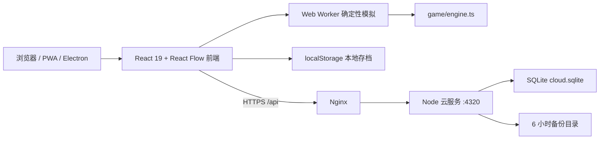

# 系统架构

## 1. 总体拓扑

前端是游戏运行时和本地数据的主载体；后端只负责账号、云存档、排行榜和运营数据，不参与每个生产周期的权威模拟。

## 2. 前端分层

### 启动层

- `src/main.tsx`：安装客户端监控，挂载 React，生产环境注册 PWA。
- `src/hooks/usePlayerPresence.ts`、`src/game/presence.ts`：进入工厂后的匿名心跳、可见性节流与本机稳定 ID；不读取游戏存档。
- `src/game/analytics.ts`：页面访问、活跃时长和白名单关键事件的会话级批处理；失败静默重试，不读取或上传游戏存档。
- `src/components/AdminDashboard.tsx`：独立 `/admin` 路由，只使用浏览器会话中的管理员 token 读取聚合运营数据。
- `src/components/StartMenu.tsx`：开始/继续、槽位、导入、云账号、邮箱验证/密码重置链接和主菜单设置。
- `src/components/CloudAccountSecurity.tsx`、`CloudSaveConflictDialog.tsx`：主菜单与银河工作区共用的账号安全、设备会话、数据导出、注销和云冲突选择界面。
- `src/components/ReleaseNotesDialog.tsx`：版本公告单一数据源、首次展示偏好和主菜单/游戏内设置共用弹窗。
- `src/App.tsx`：顶层会话和工厂编排。它管理工作区、画布交互、连接、选中状态、存档定时器和模拟 Worker。

### 展示与交互层

- `src/components/FactoryNodes.tsx`：矿脉、生产、电力、仓储、分流器和物流站节点。
- `src/components/FactoryEdges.tsx`：线路路径、标签、层级、监测和连接虚影。
- `src/components/GamePanels.tsx`：资源栏、行星导航、检查器、制造与施工托盘。
- `src/components/*Workspace.tsx`：科技、配方、统计、星图、蓝图、戴森规划、战役、银河和运营中心。
- `src/components/CatalogPicker.tsx`：配方和物品的面板式选择器。新增长列表选择应优先复用它。
- `src/hooks/`：粗指针、横向滚动、长按和抽屉滑动等跨组件交互。
- `src/styles.css`：当前统一样式入口，包含桌面、手机横竖屏、字体倍率和动效降级规则。

大型工作区由 `React.lazy` 按需加载，避免初始界面一次装入全部功能。

### 领域层

- `src/game/types.ts`：领域 ID、实体、线路、科研、银河、蓝图和 `GameState` 类型。
- `src/game/content.ts`：物品、建筑、配方、施工成本、科技和内容闭合审计。
- `src/game/engine.ts`：确定性生产、电网、运输、科研、手搓、戴森与状态变更命令。
- `src/game/network.ts`：线路占用、吞吐预测、连续网络与瓶颈诊断。
- `src/game/statistics.ts`、`planning.ts`、`alerts.ts`：统计、目标产能反推和故障聚合。
- `src/game/campaign.ts`、`progression.ts`、`endgame.ts`：任务、成就和终局 progression。
- `src/game/storage.ts`：迁移、校验和、离线结算、槽位、备份与快照。
- `src/game/cloud.ts`：同源 `/api` 客户端、会话和 8 秒请求超时。
- `src/game/mods.ts`、`contentPacks.ts`：内容包格式校验、依赖和运行时目录注入。

## 3. 状态与模拟流

1. 主菜单调用 `loadGame()` 或加载指定槽位，得到 `LoadedGame`。
2. `FactoryGame` 以 `GameState` v24 作为唯一持久游戏状态。
3. 正常模式每 100 ms、性能模式每 250 ms 累积真实时间，并乘以 `1x/2x/4x` 模拟倍率。
4. 浏览器支持 Worker 时，状态和时间提交给 `src/game/simulation.worker.ts`；Worker 调用 `advanceSimulation()`。
5. Worker 不可用或报错时，主线程使用同一个 `advanceSimulation()` 回退，保持规则一致。
6. 返回的新状态驱动节点、线路、面板和统计重新渲染。
7. 按设置中的 2/10/30 秒间隔自动保存，并在卸载前再保存一次。

模拟器应保持纯状态输入和确定性输出。新增随机机制必须从持久化 seed 派生，不能直接依赖 `Math.random()` 或墙上时钟，否则基准哈希、离线结算和云存档会分叉。

## 4. 内容模型

核心内容使用字符串联合 ID 和 `Record<ID, Definition>`：

- 物品：名称、符号、颜色、固体/流体/矩阵类型和说明。
- 配方：设备、周期、输入、输出和可选科技要求。
- 建筑：类型、速度、缓存、电力、等级和设备族。
- 科技：矩阵成本、层级、前置和解锁说明。
- 施工定义：制造成本、产量和科技要求。

修改内容时必须运行 `validateContentCatalog()` 和 progression audit。新内容不能只加显示项，还要闭合 ID 类型、定义、来源/用途、解锁、制造和迁移引用。

内容包会在模块加载阶段先恢复注册表并修改运行时目录，然后才迁移存档。不能把这一次序颠倒，否则包含扩展 ID 的存档会在迁移时丢失引用。

## 5. 画布与物流

React Flow 只负责可视节点、边、视口和交互；真实生产库存与运输状态都在 `GameState` 中。显示层通过实体和线路派生 Node/Edge，不应把 React Flow 的临时对象当作存档真相。

线路模型包含源、汇、物品、等级、分拣等级、优先级、堆叠、路由、流量和拥堵。端口能够根据已有配方、物流槽或默认状态自动接受物品。多条同端点线路由 bundle 信息进行视觉错位。

闲置物流运输机和运输船保存在 `GameState.portableFleet`，不属于任何行星托盘；装入物流站后仍由对应实体的 `stationDrones` / `stationVessels` 持有。切换行星不复制普通库存，只保留这一明确的随身载具库存和光标单组载荷。

节点卡片必须高于线路并拦截指针事件；连接虚影和成功/失败反馈属于临时 UI 状态，不写入存档。

## 6. 存档架构

### 本地

| 数据 | 键或位置 | 说明 |
| --- | --- | --- |
| 主存档 | `dsp-idle-network.save.v1` | v2 envelope 内含 v24 state |
| 主备份 | 主键后缀 `.backup` | 每次写主存档前保存上一份有效版本 |
| 快照 | 主键后缀 `.snapshot.*` | 最多 5 份，至少每 30 模拟秒生成 |
| 手动槽位 | `dsp-idle-network.slot.1..3` | 3 个独立槽位 |
| 云 token | `dsp-idle-network.cloud-token.v1` | 仅安全入口调用云 API |
| 云同步标记 | `dsp-idle-network.cloud-sync.v1` | 按云用户记录最后同步修订、云 SHA-256 和游戏状态校验值，不包含存档 payload |
| 匿名玩家 ID | `dsp-idle-network.player-id.v1` | 仅在进入工厂后生成；服务器只保存其 SHA-256 哈希 |
| 本地身份与榜单账本 | `dsp-idle-network.account.v1` | schema v2；可显式绑定一个云用户，绑定不改写 `GameState` 或工厂存档 |
| 已读版本公告 | `dsp-idle-network.release-notes.seen.v1` | 仅保存最近已确认的公告 ID，不属于游戏存档 |
| 内容包注册表 | 见 `contentPacks.ts` | 必须先于存档迁移加载 |

`saveGame()` 发生配额错误时不会中止模拟，所以“界面继续运行”不代表“存档一定成功”。涉及大型内容包或更大蓝图时，应增加存储容量和失败提示测试。

### 离线结算

- 未暂停存档按离线秒数调用同一模拟器。
- 基础上限为 7 天，终局连续体研究每级增加 1 天，最高 30 天。
- 离线报告汇总新增物品、完成科技、戴森结构、终局研究和银河出口。
- 离开 72 小时以上会发放一次带领取凭据的基础回归物资。

### 云端

云端保存的是完整导出 payload 和元数据。元数据包含 SHA-256、状态校验值、保存时间、状态版本、运行时长、设备/科技数量等安全摘要。上传必须携带 `expectedRevision`，版本冲突返回 409；前端通过本地同步标记区分本地更新、云端更新和双向分叉，只有玩家明确选择后才推进修订。恢复历史版本会生成一个新的修订，不会原地覆盖历史。每个用户最多保留最近 20 个修订。

## 7. 云服务

`server/index.mjs` 是无框架 Node HTTP 服务，生产使用 `better-sqlite3`。SQLite 当前只有一行 `app_state` JSON payload，启用 WAL 和 `synchronous=NORMAL`。云服务 schema v5 在 v4 运营统计之外增加邮箱验证、密码重置、带设备信息的会话和云存档摘要；v3/v4 旧账号迁移后按已验证处理，避免锁死现有玩家，账号、云存档、榜单、玩家记录和匿名统计都会保留。

API 表面：

- `GET /api/health`、`GET /api/public-status`
- `GET /api/admin/metrics`：至少 32 字符的管理员 bearer token
- `POST /api/analytics`：匿名批次、客户端序列去重和严格事件白名单
- `POST /api/presence`
- `POST /api/auth/register|login|logout|verify-email|resend-verification|forgot-password|reset-password`
- `GET /api/account`、`GET /api/account/sessions|export`、`POST /api/account/password|sessions/revoke|delete`
- `GET|PUT /api/cloud-save`、`GET /api/cloud-save/history`、`POST /api/cloud-save/restore`
- `GET|POST /api/leaderboard`
- `POST /api/feedback`、`POST /api/errors`

密码使用 scrypt 派生并采用 timing-safe 比较；会话 token 和邮箱动作 token 只保存 SHA-256，登录会话默认有效期 30 天，邮箱动作链接有效期 30 分钟。新账号验证前可以登录和读取自己的数据，但不能写入云存档、恢复云修订或提交排行榜。邮件通过可选 webhook 发送；未配置 webhook 时新注册与邮件恢复明确返回不可用。请求体上限为 8 MiB，认证接口每 IP/路径每分钟 12 次，其余接口 120 次。Origin 白名单、Nginx `client_max_body_size` 和前端 HTTPS 限制共同形成入口边界。

匿名心跳默认每 45 秒发送一次，服务端接口限流为每 IP 每分钟 10 次；同一浏览器 ID 去重，最近 120 秒有心跳视为在线。访问统计按 `Asia/Shanghai` 自然日聚合 PV、UV、会话、进入工厂、活跃秒数和允许的关键事件。服务端只保存带命名空间的 SHA-256 标识，不保存原始匿名 ID、鼠标坐标、按钮文案或存档内容。香港与上海数据库相互独立，因此统计也是节点级数据，不做跨节点合并。

## 8. 部署架构

- Nginx 静态根目录：`/var/www/dsp-idle/current`
- 云服务代码：`/opt/dsp-idle-cloud/current`
- 云数据库：`/var/lib/dsp-idle-cloud/cloud.sqlite`
- 云备份：`/var/lib/dsp-idle-cloud/backups`
- 云进程：绑定 `127.0.0.1:4320`，只能经 Nginx 暴露
- systemd：云服务自动重启；健康检查每两分钟访问本机 `/api/health`。
- 运维工具链：每日异地备份使用公钥认证加密，恢复节点每月在隔离目录启动临时 API 演练；五分钟节点探针检查公网端点、磁盘和 TLS，结果通过管理员指标读取。

正式香港节点与上海旧节点各自运行本机 API 和数据库。上海不能反代或重定向到香港，否则会破坏当前备用入口边界。具体运行手册见 [DEPLOYMENT_OPERATIONS.md](./DEPLOYMENT_OPERATIONS.md)。

## 9. 当前结构性问题

- `App.tsx` 同时承担会话、画布、工作区和大量命令编排，应逐步拆成运行时 hooks 与工作区控制器。
- `engine.ts` 包含多个领域，应按“模拟内核、实体命令、电力、物流、科研、戴森”分模块，但保持公共确定性入口。
- `styles.css` 超过一万行，应按 shell、canvas、workspace、responsive 分层，并保留加载顺序测试。
- 云端单 JSON row 在用户量增长后会造成整块序列化和写放大，应在有真实规模数据后再迁移到规范化表，而不是提前重写。
