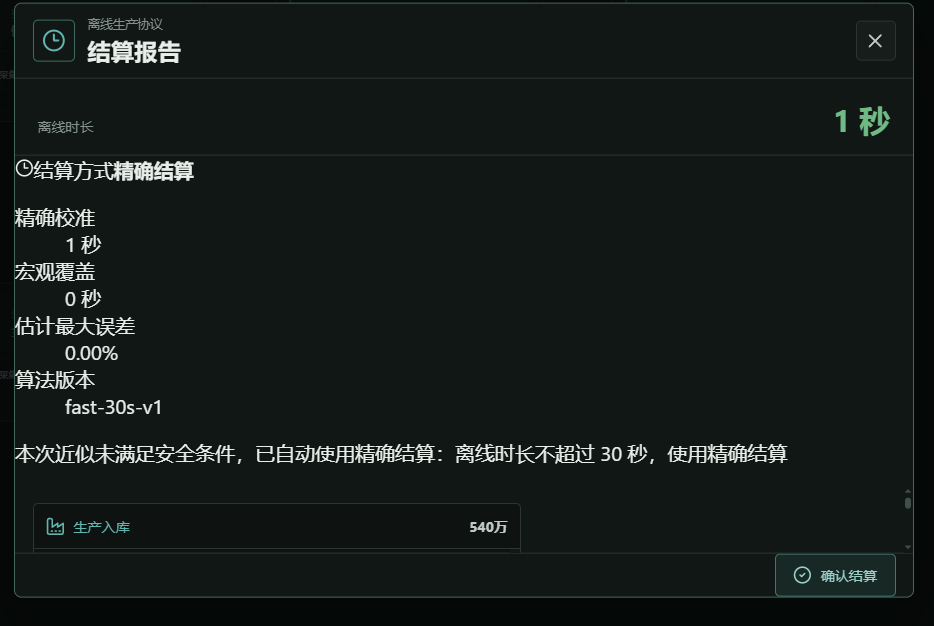
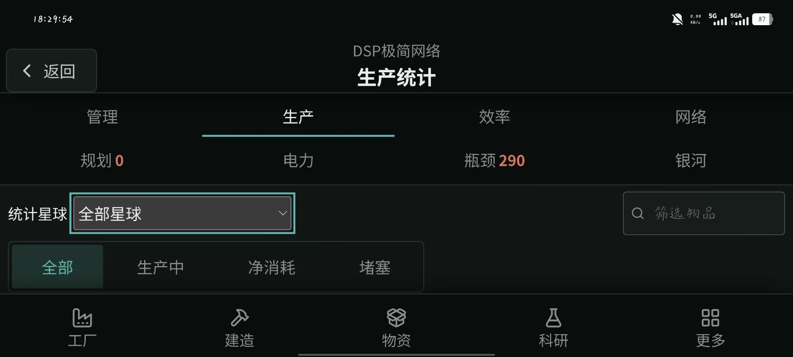
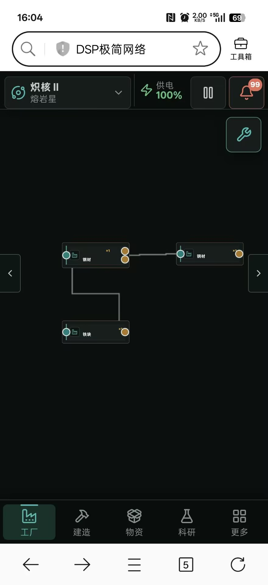

# 2026-08-05 玩家反馈批次开发交接（11 项）

## 0. 给开发 Agent 的任务说明

你负责在当前 `DSPidle2 / DSP 极简网络` 工作区实现本批 11 项需求。当前工作区已有其他开发任务的未提交修改，包括 `1.0.30` 开发态的 `fast-30s-v1` 快速离线结算、速通模式和 UI 调整。所有已有改动都视为用户或其他 Agent 的工作：不得 `reset`、`checkout`、`clean`、覆盖或顺手重构。

开始前必须：

1. 阅读并遵循仓库 `develop-dspidle` Skill、`docs/PROJECT_STATUS.md`、`docs/ARCHITECTURE.md` 和 `docs/GAMEPLAY_SYSTEMS.md`。
2. 以当前工作区实际代码为唯一基线，不依赖旧版本行号或旧文档推断。
3. 先复现、补测试，再实施修复；每项改动保持独立、可审查。
4. 不修改附件存档，不把玩家存档写入测试输出或正式仓库。
5. 不部署 VPS、不更新下载页、不制作或发布安装包，除非用户后续明确授权。

### 优先级

| 优先级 | 项目 |
|---|---|
| P0 | 4. 快速离线结算读取 `undefined.id`，导致无法进入存档 |
| P1 | 1. 离线报告 UI、2. 统计历史曲线、3. 取消科技续队列、5. 施工托盘删除、7. 移动统计滚动、9. 重复输出口、10. 接口线路数量、11. 时间扭曲高倍率 |
| P2 | 6. 关闭物品悬浮窗、8. 重整精炼文案 |

---

## 1. 离线结算报告布局错误（P1 UI Bug）

### 玩家附件



### 现状

离线报告中“结算方式、精确校准、宏观覆盖、估计最大误差、算法版本”等内容失去预期布局。标题、字段和值全部挤在左侧，缺少正常的卡片/网格间距，正文留白异常，信息层级难以阅读。

### 预期

- 恢复结算方式区域的稳定卡片或网格布局。
- 标签和值在桌面、手机、平板及 80%～200% 字号下正确对齐。
- `精确结算`、`近似宏观结算`、`安全回退` 三种状态都必须完整显示。
- 内容区域可滚动，底部“确认结算”和右上角关闭按钮始终可见、可点击。
- 不允许报告内容撑破弹窗，也不能让底部操作栏覆盖最后一条生产记录。
- 亮色和深色主题都需检查。

### 验收

- 使用 1 秒精确结算、长时间快速结算和快速路径回退三类报告截图回归。
- 桌面 1280×720、1920×1080，手机竖屏和平板横屏均无错位、遮挡或横向溢出。

---

## 2. 生产统计增加历史时间范围曲线（P1 功能）

### 需求

当前生产统计主要显示当前时刻/当前采样速率。增加时间范围切换，并显示对应产量趋势：

- 过去 1 分钟
- 过去 10 分钟
- 过去 1 小时
- 累计总产量

本项是之前“每秒/每分钟/每十分钟/每小时单位切换”的扩展：必须是历史趋势曲线，不只是把当前数字换算单位。

### 交互和数据

- 使用标签页或分段控件切换时间范围。
- 曲线明确显示时间轴、产量轴、物品名称和万/亿等可读单位。
- 当前已有的星球筛选、生产中/净消耗/堵塞筛选和物品搜索继续生效。
- 切换筛选和时间范围不能触发主线程长时间卡顿。
- 1/10/60 分钟使用分级采样或环形缓冲，不能无限追加历史记录。
- “累计总产量”读取现有 `totalProduced`；旧存档无法还原更新前的完整曲线时，明确从新版本开始采样，不伪造历史。
- 优先保持历史曲线为运行时/紧凑聚合数据，避免重新制造存档膨胀问题。

### 验收

- 稳定产线、停产、断料、恢复生产和切换星球时，曲线方向与真实状态一致。
- 终局存档打开统计页、切换范围和筛选时保持可交互。
- 验证历史数据有明确上限，主存档大小不会持续无界增长。

---

## 3. 取消当前科技后自动开始队列下一项（P1 Bug）

### 现状

点击当前科技旁的 `X` 取消研究后，系统进入无研究状态，不会自动开始研究队列中的下一项。

### 预期

- 取消当前研究后，按照原队列顺序查找下一项满足前置条件的科技并自动开始。
- 暂时不满足前置条件的项目保留在队列，不删除、不乱序，继续向后查找可研究项。
- 被取消科技已经投入的矩阵和研究进度继续按照当前规则保留。
- 队列中没有任何可研究项目时才进入“未设置研究项目”。
- 自动切换不能删除科研站矩阵缓存、配方状态、接口或合法线路。
- 无限科技和普通科技的切换边界需要明确测试。

### 测试

- 当前科技 + 两项合法队列。
- 下一项前置不满足、第三项满足。
- 队列全部不可研究。
- 取消后保存重载、离线结算和手机端科技页面状态一致。

---

## 4. `fast-30s-v1` 快速离线结算崩溃（P0 Bug）

### 复现附件

- 玩家存档保留在本机受保护附件区，实际路径和原始文件不进入仓库。
- 仅允许在内存副本上读取和测试，不得覆盖附件。

### 玩家看到的错误

```text
Cannot read properties of undefined (reading 'id')
```

### 已完成的只读核验

- 存档 envelope v2、GameState v46，可以正常迁移。
- 224 个实体、191 条传送带。
- 精确离线模拟 60 秒正常完成，说明存档本身并未损坏。
- 快速离线真实存档基准可以稳定复现异常。

复现命令：

```powershell
$env:DSP_FAST_OFFLINE_FIXTURES='<LOCAL_PROTECTED_SAVE>'
npm test -- --run src/game/offlineFastSettlementBenchmark.test.ts --reporter=verbose
```

调用栈核心位置：

```text
constructionAutomationTarget
constructionAutomationHasDeficit
calculatePower
runFastOfflineSettlement -> 最终 5 秒精确验证
```

### 已定位根因

`fast-30s-v1` 把 `constructionAutomation.cursor` 包含在仿射批量外推字段中。该字段是建筑制造目标数组的循环索引，不是可线性增长的产量。校准窗口中游标发生回绕后，长时间放大可能生成负值或越界值。JavaScript 负数取模仍为负数，`constructionAutomationTarget()` 从数组得到 `undefined`，随后读取 `definition.id` 崩溃。

### 修复要求

- `constructionAutomation.cursor`、`routingCursor`、`stationDispatchCursor` 及其他枚举/循环索引不得参加产量线性外推。
- `normalizeFastSettlementState()` 必须规范化所有必须保留的循环游标。
- `constructionAutomationTarget()` 自身使用安全取模：先整数化，再将负数归一到 `[0, length)`；同时防御空定义。
- 快速路径的校准、宏观应用和最终精确验证都必须捕获领域异常，从原始副本安全回退精确路径，不能把 JavaScript 错误直接显示给玩家。
- 异常时不能提交宏观外推半成品，也不能改写原存档时间戳。
- 精确回退本身失败时提供可理解的错误和“放弃离线直接进入”入口。

### 回归要求

- 使用附件分别测试 10 分钟、1 小时、7 天和 30 天。
- 快速结果可以是 `approximate` 或安全 `fallback`，但不得抛异常或阻止进入游戏。
- 增加负游标、超大游标、游标回绕、目标列表变化、制造中心启停和保存重载测试。
- 快速结算结果通过序列化、读回、checksum、非负数量和安全整数校验。

---

## 5. 施工托盘“回收”改为删除建筑库存（P1 功能修正）

### 产品语义

当前施工托盘“回收”实现方向错误。用户需要删除施工托盘库存中的建筑物品，不是拆除画布建筑，也不是回收材料。

### 交互

1. 将施工托盘中的“回收”按钮改为“删除”。
2. 点击后进入单选删除模式。
3. 玩家选择一个施工托盘卡片，例如“传送带 Mk.1 ×99”。
4. 弹出二次确认：物品名称、当前数量、删除后不可恢复。
5. 确认后把该建筑物品当前全部数量删除为 0。
6. 取消时不修改任何状态并退出确认。

### 约束

- 首版只允许单选，不做多选。
- 不影响画布实体、物资托盘原料、光标载荷、蓝图和其他建筑库存。
- 不返还材料。
- 数量为 0 时按钮禁用。
- 确认瞬间重新读取实际数量，避免弹窗期间数量变化造成错删或提示不一致。
- 如果建筑制造中心仍设置了该建筑的自动补货目标，确认文案应提示后续可能重新生产；不能静默修改玩家的制造策略。
- 二次确认不得被 `alert` 或输入焦点问题破坏。

### 测试

- 传送带、普通建筑、物流塔和巨构建筑库存。
- 删除期间库存增加/减少。
- 自动制造目标仍开启。
- 保存重载后数量保持为删除后的状态。

---

## 6. 可关闭物品详情悬浮窗（P2 功能）

### 玩家附件


### 需求

在“设置 → 交互与控制”增加设备级开关：

```text
显示物品悬浮信息
```

- 默认开启，保持当前行为。
- 关闭后鼠标悬浮或焦点停留在物品上时，不再出现完整详情卡片。
- 关闭开关的瞬间，当前已经打开的悬浮窗立即消失。
- 不影响物品点击、拖动、制造、定位、打开图鉴和移动端正常点击交互。
- 偏好仅保存在本机设备，不写入 GameState、导入导出或云存档。
- 之前记录的“缩小悬浮判定范围”仍然保留；本项是额外的全局关闭功能。

### 测试

- 深色/亮色模式、鼠标 hover、键盘 focus、Portal 打开期间关闭设置。
- 返回主页、重新进入工厂和刷新页面后偏好仍生效。

---

## 7. 手机/平板生产统计无法向下滚动（P1 UI Bug）

### 玩家附件



### 现状

横屏手机/平板的生产统计页只能看到标题、标签和筛选区域，数据列表位于底部导航后方。页面没有有效纵向滚动，玩家无法查看下方内容。

### 修复要求

- 统计主体建立明确的纵向滚动容器，并支持触摸滚动与惯性滚动。
- 底部导航可以固定，但内容必须预留导航高度和 `safe-area-inset-bottom`。
- 父级 `overflow: hidden`、固定高度、抽屉手势和页面手势不能吞掉统计区纵向滑动。
- 顶部标题/分类可固定，统计数据和曲线区域独立滚动。
- 内容超过视口时提供滚动条或明确滚动反馈。
- 切换分类、星球、搜索和第 2 项的时间范围后仍能滚动。
- 最后一项数据必须能完整滚动到导航栏上方。

### 验收视口

- Android 手机竖屏/横屏。
- 平板横屏。
- 浏览器全屏和非全屏。
- 80%、100%、150%、200% 字号。
- 新版手机 UI 和经典回退 UI 不互相切换或丢失输入焦点。

---

## 8. 科技层级 6“重整精炼”描述错误（P2 文案 Bug）

### 现有问题

当前描述：

> 以煤和氢重整精炼油，建立可控的油路循环增产路线。

文案没有说明配方还需要精炼油作为输入，容易被理解为仅用煤和氢直接生产精炼油。

### 正确配方语义

```text
2 精炼油 + 1 煤 + 1 氢 -> 3 精炼油
净增加 1 精炼油
```

### 建议文案

> 消耗 2 份精炼油、煤和氢，重整产出 3 份精炼油，每轮额外获得 1 份精炼油，建立可控的油路循环增产路线。

### 要求

- 同步检查科技卡、科技详情、配方图鉴、教程和英文翻译。
- 本项只修正文案，不调整现有配方输入、输出、时间或建筑兼容性。

---

## 9. 锁定建筑仍被自动识别改配方并产生重复输出口（P1 Bug）

### 玩家附件



### 玩家复现描述

> 现在机器就算锁定了，配方自动识别也可以改配方，并且输出接了带子也能自动识别改配方，效果是原有带子还在，多了一个输出口。

截图中左侧钢材建筑本应只有一个黄色输出口，却出现两个黄色输出口。

### 预期

- 锁定建筑禁止配方自动识别修改配方。
- 锁定状态连接不兼容物品时拒绝连接，并给出明确提示。
- 已有输入/输出线路的建筑，自动识别配方前必须验证所有连接兼容性。
- 自动识别遇到冲突时直接取消，不自动拆线、不静默改配方。
- 端口数量由当前建筑和配方定义派生，不能在旧端口基础上追加。
- 配方切换后不得保留指向不存在端口的悬空线路。

### 历史状态修复

- 加载或规范化已经出现重复端口的存档时恢复正确端口数量。
- 优先保留合法线路；无法映射的失效线路应安全拆除并返还传送带。
- 不删除建筑、库存或合法连接。

### 回归

- 锁定/未锁定、有无输出带、自动识别成功/冲突。
- 配方一输入一输出、多输入单输出和副产物配方。
- 手机端、桌面端、保存重载和蓝图放置。

---

## 10. 接口上方传送带数量需首次运输后才正确（P1 UI Bug）

### 现状

建筑输入/输出接口上方的已连接传送带数量在刚完成连接时不显示或显示错误，只有第一批货物实际通过后才刷新正确。

### 预期

- 线路连接成功后立即显示正确的连接数量，不等待第一次运输。
- 空带、堵塞、断料、建筑断电、暂停和未设置配方时仍显示真实连接数量。
- 添加、拆除、批量连接、蓝图放置、导入存档和重载后立即刷新。
- 数量必须从权威线路拓扑派生，不能依赖 `lastFlow`、`totalTransferred`、生产速率或运行时流量。
- 显示刷新不得改变端口数量或线路本身。
- 桌面与移动端一致。

### 回归

- 单线、多线、并联线路、空带、暂停状态。
- 连接后不推进任何模拟 tick，UI 也必须立即正确。
- 与第 9 项重复端口修复共同测试，但保持两个问题的领域逻辑独立。

---

## 11. 时间扭曲纯挂机在 8 倍以上无法稳定计算（P1 性能）

### 产品取舍

用户接受终局时间扭曲存在一定数值偏差，优先保证高倍率纯挂机可以持续运行、不假死。该需求更新此前的“硬件不足时自动降档”策略：性能不足时应优先切换宏观近似推进，而不是长期被限制在 8 倍以下。

### 目标

- 纯挂机模式稳定支持 8x、12x、16x 等十几倍请求倍率。
- 普通玩法、画布交互和未开启时间扭曲时继续使用现有权威模拟路径。
- 时间扭曲纯挂机期间停止画布、动画、检查器和非必要统计刷新。
- 模拟计算放在 Worker，主线程保持可响应。
- 可复用 `fast-30s-v1` 的“短精确校准 + 宏观批量推进”思路，但不能与离线时间戳或离线收益重复结算。
- 允许非关键产量数据最高约 20% 偏差；仍禁止负库存、NaN、Infinity、非法安全整数、坏档和重复发放。

### 功耗与性能必须分开

- 保留现有时间扭曲耗电公式。
- 供电不足导致的倍率下降属于玩法限制。
- CPU/Worker 跟不上属于计算限制；此时切换近似推进，不应伪装成供电不足。
- UI 分别显示请求倍率、实际倍率、供电限制、计算模式和近似状态。

### 状态提交和停止

- 使用短窗口批量提交，不能生成无限增长的待处理时间债务。
- 只有 Worker 返回并通过结构校验后才能提交新状态。
- 停止纯挂机后立即停止创建新预算；未提交预算可以舍弃，不得在恢复交互后继续追赶。
- 停止或暂停后应在数秒内恢复游戏，不得等待大批积压精确补算。
- Worker 崩溃、取消或校验失败时回到最后一个有效状态。
- 快速路径中的循环游标必须应用第 4 项修复，不能再次出现 `undefined.id`。

### 性能验收

- 使用真实终局存档连续测试 8x、12x、16x，各至少 5 分钟；候选发布前补 30 分钟稳定性测试。
- 记录请求倍率、实际推进倍率、Worker 延迟、CPU、内存、积压秒数和停止响应时间。
- 高倍率期间界面不假死，停止后数秒内恢复。
- 模拟实际推进速度应接近玩家请求倍率；偏差原因必须能区分供电限制与计算限制。
- 保存、重新加载、云上传和暂停恢复后没有重复收益或时间债务。

---

## 12. 跨项工程要求

### 状态和存档

- 除非确有必要，不升级 GameState、save envelope、云 schema 或 SQLite layout。
- 新增 UI 偏好优先使用设备级持久化，不污染玩家存档。
- 任何迁移必须继续接受历史合法存档，并通过导出、导入和 checksum 读回。
- 不得把生产历史曲线重新写成无上限数组。

### UI

- 桌面、手机、平板，深色、亮色，80%～200% 字号全部覆盖。
- 图标沿用项目现有 Lucide 体系。
- 不新增卡片套卡片，不让固定底部导航遮挡正文。
- 文案需同步中文与现有英文翻译路径。

### 最低测试门禁

- 相关 Vitest 单元/领域测试。
- `npm run typecheck`。
- 相关 Playwright 桌面和移动视口回归。
- P0 存档附件的只读真实夹具测试。
- 快速离线和时间扭曲的取消、回退、结构校验、序列化和重载测试。
- 生产统计长列表、曲线范围和移动滚动测试。
- 完整测试若因当前共享工作区其他未提交任务失败，必须区分既有失败与本次回归，不能静默忽略。

## 13. 交付格式

完成后提供：

1. 11 项逐项状态：完成、部分完成或阻塞。
2. 每项对应的主要文件和测试。
3. P0 根因与修复说明。
4. 真实存档快速离线测试结果。
5. 时间扭曲 8x/12x/16x 的实际性能数据，不能只写主观“更流畅”。
6. 所有残余风险、数值偏差和回滚方式。
7. 未经用户明确授权，不执行生产部署、VPS 操作或安装包发布。
